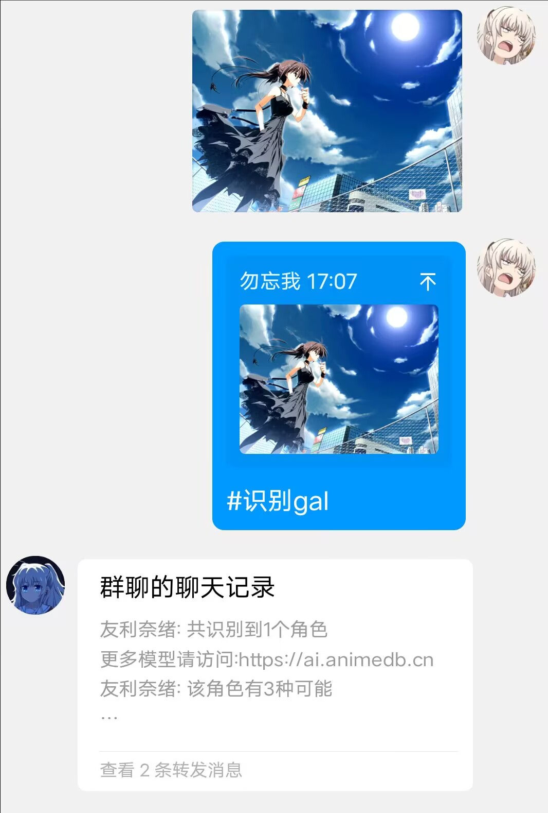
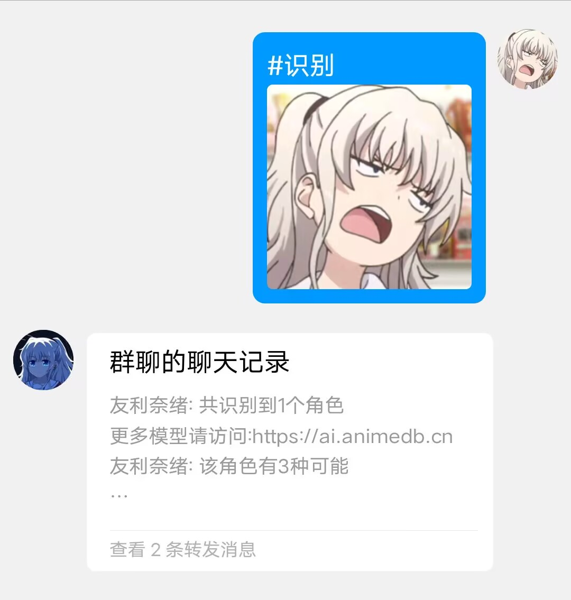
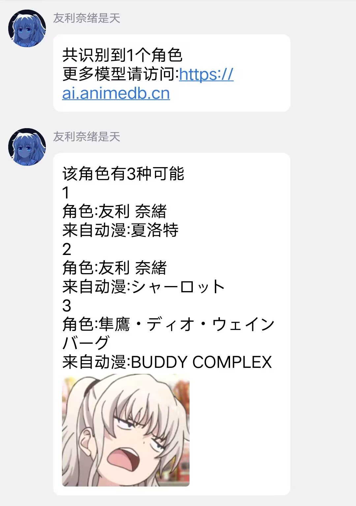

  
   
  

# nonebot-plugin-anime-trace

_✨ 通过 ai.animedb.cn 的 api 识别动漫、galgame 角色 ✨_

## 最新情报

前两天网站抽风，现已恢复正常。2023/08/25

## 💿 安装

使用 nb-cli 安装

在 nonebot2 项目的根目录下打开命令行, 输入以下指令即可安装

    nb plugin install nonebot-plugin-anime-trace

使用包管理器安装

在 nonebot2 项目的插件目录下, 打开命令行, 根据你使用的包管理器, 输入相应的安装命令

    pip install nonebot-plugin-anime-trace

打开 nonebot2 项目根目录下的 `pyproject.toml` 文件, 在 `[tool.nonebot]` 部分追加写入

    plugins = ["nonebot-plugin-anime-trace"]

## 🎉 使用

默认配置下

命令: {#} {识别|角色|人物|} [gal|动漫]

说明：命令符不是命令头，只要包含命令符和命令关键字就会触发响应，例如“foo 识别 foo#foo”也可以触发

大括号内{}为必要关键字, 中括号内[]为可选参数, 默认使用动漫模型

附带一张图片、或回复一张图片、或再发送一张图片

可以自定义命令符、命令关键字

示例:

|  |  |
| ---------------------------- | ---------------------------- |

|  |  |
| ---------------------------- | ---------------------------- |

## ⚙️ 配置

如果需要自定义配置，请在 nonebot2 项目的`.env`文件中添加配置

|         配置项         | 必填 |          默认值          |              说明              |
| :--------------------: | :--: | :----------------------: | :----------------------------: |
|  animetrace_ai_detect  |  否  |          False           |         是否检测 ai 图         |
|     animetrace_cmd     |  否  |           "#"            |             命令符             |
|   animetrace_keyword   |  否  | ["识别", "角色", "人物"] |           命令关键字           |
|  animetrace_priority   |  否  |            10            |           响应优先级           |
| animetrace_model_anime |  否  |       "pre_stable"       |            动漫模型            |
|  animetrace_model_gal  |  否  |  "game_model_kirakira"   |          galgame 模型          |
|   animetrace_max_num   |  否  |            3             |  一个角色最多返回几个识别结果  |
|        nickname        |  否  |     ["anime trace"]      | bot 昵称列表，只取 nickname[0] |

动漫模型和 galgame 模型请前往 [ai.animedb.cn](https://ai.animedb.cn)查看

## 常见问题 Q&A

### 没有识别到任何角色

网站没有识别到该图中的角色

### 出错啦~可能是图里角色太多了 content:{code:-1}

网站处理图片出错，可能是图中角色过多、或者网站后端挂了，可以尝试裁剪图片

### 识别失败，换张图片试试吧~<Response [504 Gateway Time-out]>

网站接收图片出错，可能是图中角色过多、或者网站后端挂了，可以尝试裁剪图片

### 其他

请先去[ai.animedb.cn](https://ai.animedb.cn)尝试能否识别，若能识别，联系我更新；若不能识别，等待站长修复

## TODO

- [x] 增加 ai 绘图鉴别
- [ ] 添加结果图片对比
